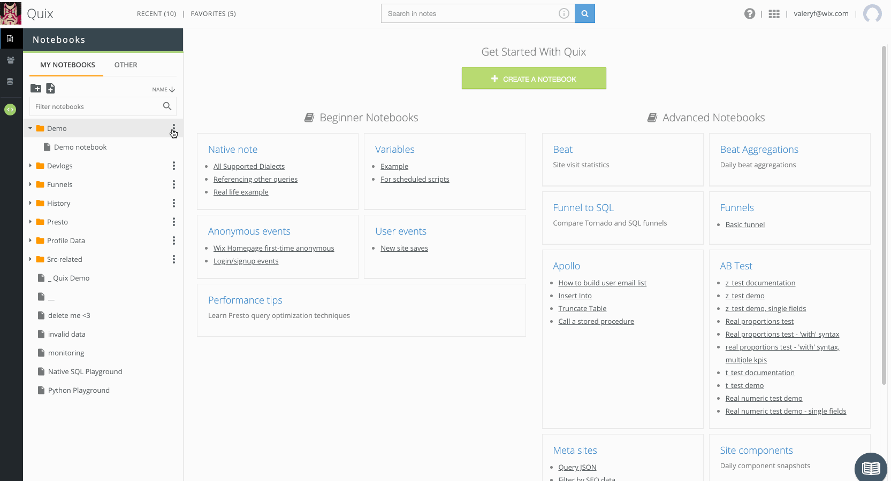

# Quix
Quix is a IDE for Presto <br />
It's your single point of truth and a shared space for your company's BI insights, with quick turnaround, interactive visual perspectives, and mixed data sources.<br />

## Main features

* Presto notes
* Notebooks
* Folders
* DB-tree
* Smart Editor



## Requirements
* Presto
* Docker Compose

 
## Installation
```
docker-compose up
open http://localhost:3000
```


## License
MIT
