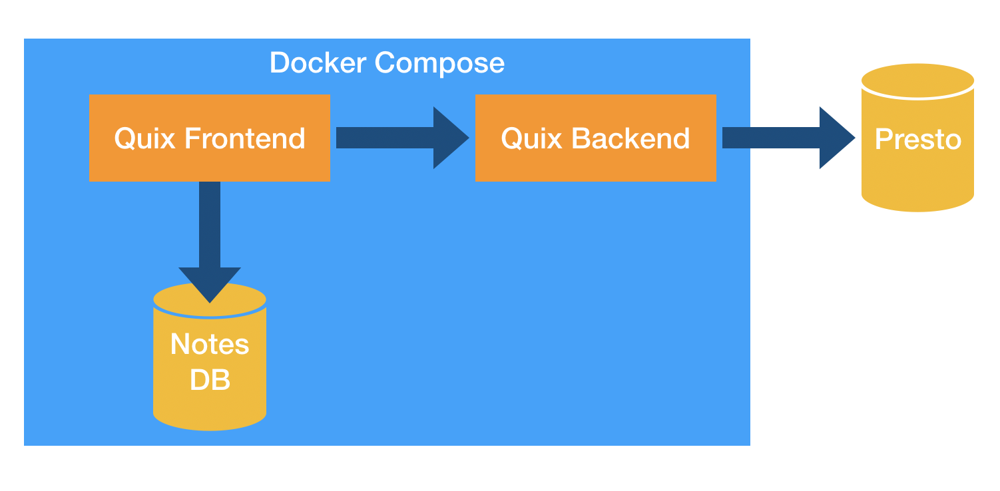

# Quix [](https://travis-ci.com/wix/quix)

> ### Disclaimer
> :exclamation: Please note **that this is a beta version** of Quix which is still undergoing final testing before its official release.


Quix is a robust easy-to-use business intelligence & data analytics tool built to handle both quick insights and massive resource-demanding queries. It features data visualization and export, user management, and organizes queries in notebooks for easy access and sharing across teams.

A web-based IDE for [Presto](https://github.com/prestosql/presto), Quix is your single point of truth and a shared space for your company's BI insights.


## What can I do with it?

Quix is flexible enough to be used in an array of applications on any scale. It can serve as a:

- Shared space for your company's BI insights
- Single point of truth for all team members on public or proprietary data
- Tool to generate visuals (like charts) based on your data
- A handy way to store and share insights based on query results

## Core features

* Presto notes
* Notebooks
* Folders
* DB-tree
* Smart Editor
<!-- TODO Full text search -->

## Requirements
* [Docker](https://www.docker.com/products) (engine, enterprise or desktop edition, whichever works for you)
* [Docker Compose](https://docs.docker.com/compose/install/)

**N.B.** Quix relies on [Presto](https://prestosql.io/), which is included with the Docker container in this repository, but for the **demo purposes** only. To work with real data, it must be accessible via a Presto API URL (more on this in [Configuring](#Configuring)).

## Setup and running

All you need to do is to run Docker Compose:

```
docker-compose up
```

The initial run of the `docker-compose up` command will take care of all the dependencies, like MySQL, Presto, Maven, etc, will install all necessary Quix components and create a web-accessible Quix instance.

To then access Quix, in your browser navigate to:
`http://localhost:3000`

## Configuring

Most of the configuration you'll need is done in the [.env](./.env) configuration file. By default, Quix works with a demo Presto instance that runs inside Docker Compose. To work with your real Presto DB, change the `PRESTO_API` URL.

##### Presto
By default, Quix works with demo Presto instance that runs inside Docker Compose. <br />
To work with your real Presto DB, change `PRESTO_API` URL.
Note that you need to specify full URL, including protocol, port and API version. For example: `http://presto.my.domain:8181/v1`

##### DB
Quix also uses MySQL to store notebooks and other application data. Location of this data is specified by `DB_VOLUME_PATH`. <br />
As an alternative, you can use an external MySQL database, by specifying some of the following variables:
* DB_NAME - defaults to `quix`, must exist
* DB_USER - defaults to `root`
* DB_PASS - defaults to empty password
* DB_HOST - defaults to `db`
* DB_PORT - defaults to `3306`

##### User authentication
Quix can work in two modes: multi-user mode, authenticated with [Google OAuth](https://console.developers.google.com/apis/credentials), or in a single-user mode. This is controlled by the following variables:
* AUTH_TYPE - can be `fake` or `google`. defaults to `fake` (single-user mode).

If you use google oauth, you must supply the clientId and the secret:
* GOOGLE_SSO_CLIENT_ID
* GOOGLE_SSO_SECRET

Other variables related to authentication:
* AUTH_COOKIE - defaults to `__quix`
* AUTH_SECRET - the encyption key for the cookie.
* COOKIE_MAX_AGE - should be in seconds, default is 30 days.

##### Configuration for custom deployment
Running quix with `docker-compose` should "just work", but when deploying quix, there are a couple more variables you might want to change:

* BACKEND_INTERNAL_URL - An address + port number (no protocol) where you have the backend service deployed and accessible to the frontend service.
* BACKEND_PUBLIC_URL - An address + port number (no protocol) to the backend service, made accessible to user's browser. In most scenarios, it's value is the same as `BACKEND_INTERNAL_URL`.
* DB_AUTO_MIGRATE - In case of upgrades/schema change, this controls whether quix should try and upgrade the schema automatically. Defaults to `true`.

## Architecture



Quix consists of three main elements:

* Frontend to serve UI and manage notebooks
* Backend to communicate with Presto
* DB for storing notebooks

Each component is run in a separate Docker container, and all of them are managed by a single Docker Compose configuration.

There's also a fourth Docker container provided with this repository running Presto inside Docker Compose, but it's for demonstration purposes only.

<!-- ### TODO User authentication -->

<!-- ### TODO ## Using Quix

N.B. REVISIT THIS PART WHEN APP IS OUT OF BETA OR WHEN UI IS MORE STABLE

Let's start with two major concepts of Quix - **notebooks** and **notes**.

#### Notes

A note is basically a record of an SQL query, which when run, retries data from your database.

Notes can be run on demand or can be scheduled to execute automatically at a specific time, or repeat based on a time interval.

Notes can be shared and query execution results can be embedded online.

#### Notebooks

Notebooks are collections of notes and are primarily used to organize things in a neat way. Notebooks helps group notes together and can also be nested within folders.
-->

## License
MIT
