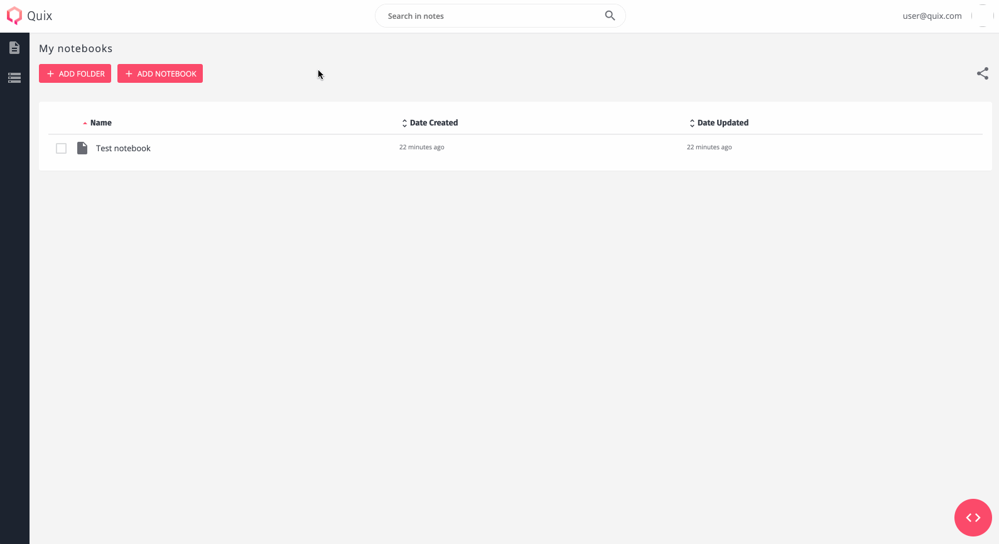
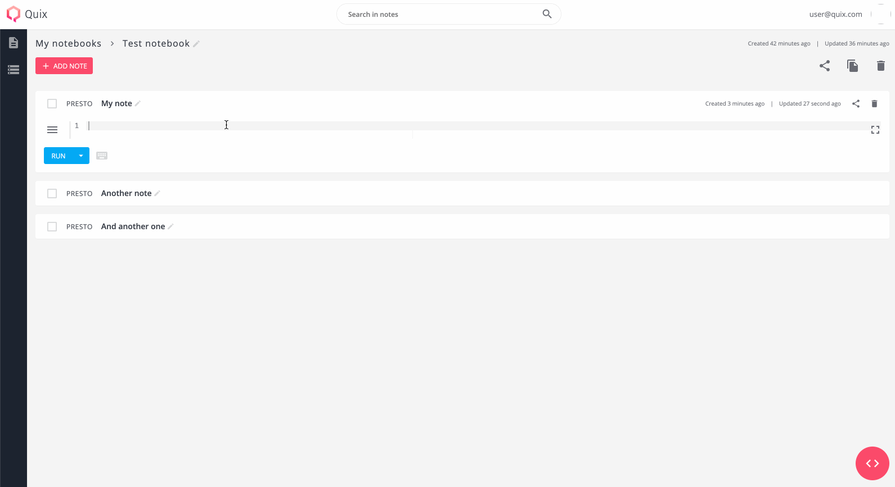
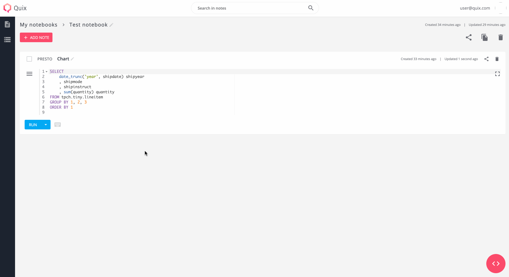
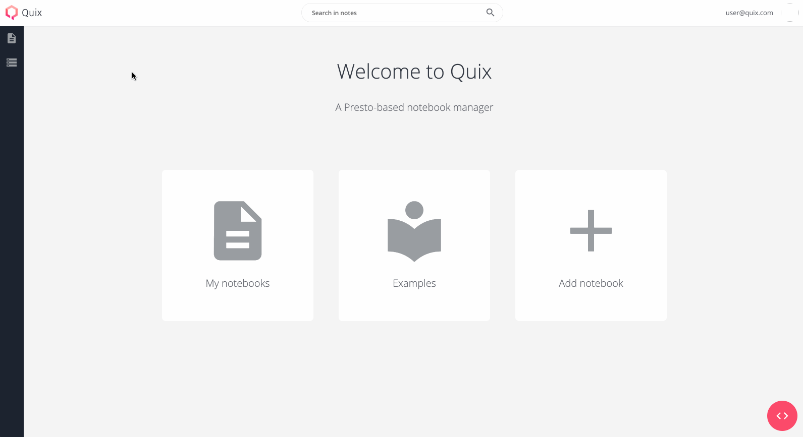

# Quix 

> :exclamation: Please note **that this is a beta version** of Quix which is still undergoing final testing before its official release.

Quix is an intuitive notebook manager based on [Presto](https://github.com/prestosql/presto) and shared space for your company's BI insights.

## Features
- User management via Google Sign-In
- Notebook/notes [management](#Organize)
  - Organize queries (notes) in notebooks
  - Organize notebooks in nested folders
- Presto queries [execution](#Run)
- DB exploration - use the DB tree to quickly explore your data sources
- Visualization - quickly [plot](#Visualize) time and bar series (more visualizations to follow)
- Search all queries accross all users
- Shareable folders, notebook and notes

#### Organize

#### Run

#### Visualize

#### Explore

#### Search

## Installation and configuration
See [instructions](docs/docs/installation.md)

## Architecture
See [architecture](docs/docs/architecture.md)

## License
MIT
