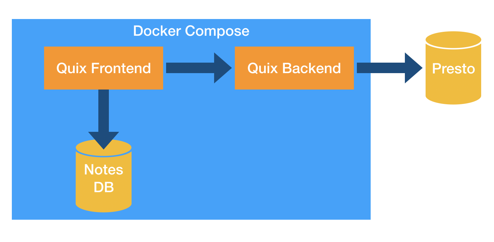

# Quix 

> :exclamation: Please note **that this is a beta version** of Quix which is still undergoing final testing before its official release.

Quix is an easy-to-use [Presto](https://github.com/prestosql/presto)-based notebook manager and a business intelligence and analytics tool. It provides a shared space for your company's BI insights

## Features
### Notebook/notes management
- Organize queries in notebooks
- Organize notebooks in folders

### Run presto queries

### Visualize results

### Explore the database

### Search accross all users

## Installation and configuration
See detailed [instructions](docs/installation.md)

## Architecture

Quix consists of three main elements:

* Frontend to serve UI and manage notebooks
* Backend to communicate with Presto
* DB for storing notebooks

Each component is run in a separate Docker container, and all of them are managed by a single Docker Compose configuration.

There's also a fourth Docker container provided with this repository running Presto inside Docker Compose, but it's for demonstration purposes only.

<!-- ### TODO User authentication -->

<!-- ### TODO ## Using Quix

N.B. REVISIT THIS PART WHEN APP IS OUT OF BETA OR WHEN UI IS MORE STABLE

Let's start with two major concepts of Quix - **notebooks** and **notes**.

#### Notes

A note is basically a record of an SQL query, which when run, retries data from your database.

Notes can be run on demand or can be scheduled to execute automatically at a specific time, or repeat based on a time interval.

Notes can be shared and query execution results can be embedded online.

#### Notebooks

Notebooks are collections of notes and are primarily used to organize things in a neat way. Notebooks helps group notes together and can also be nested within folders.
-->

## License
MIT
